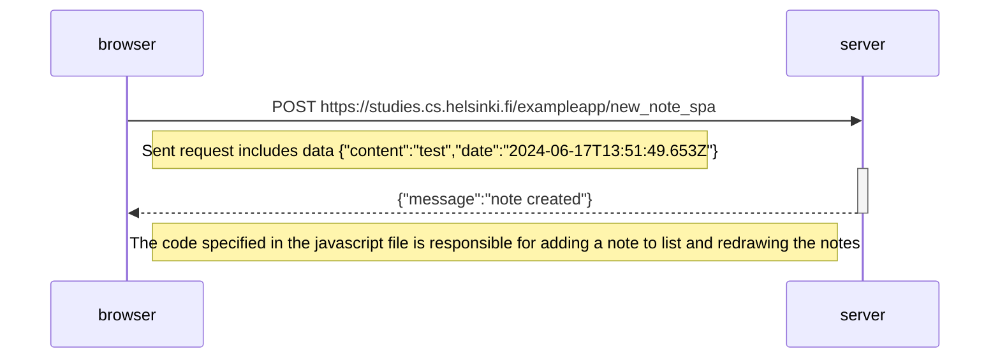

```mermaid
sequenceDiagram

    participant browser
    participant server

    browser->>server: POST https://studies.cs.helsinki.fi/exampleapp/new_note_spa

    Note right of browser: Sent request includes data {"content":"test","date":"2024-06-17T13:51:49.653Z"}

    activate server
    server-->>browser: {"message":"note created"}
    deactivate server

    Note right of browser: The code specified in the javascript file is responsible for adding a note to list and redrawing the notes
    
    
```